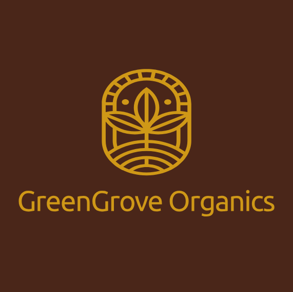

# GreenGrove Organics  

## Project Overview
Green Grove is a website designed to promote sustainable living and eco-friendly practices. It provides resources, tips, and information to help users make environmentally conscious decisions in their daily lives.  

## Website Goals and Objectives  
- Educate users about sustainable living.  
- Provide actionable tips for reducing environmental impact.  
- Promote eco-friendly products and services.  
- Build a community of like-minded individuals passionate about sustainability.  

## Sitemap  
**1. Home (index.html)**  
    - Introduction to Green Grove and its mission.  
    - Highlights key features and recent updates.  

**2. About (about.html)**  
    - Details about the organization and its history.  
    - Information on the team and their commitment to sustainability.  

**3. Blog (blog.html)**  
    - Articles and posts on eco-friendly practices.  
    - Tips for sustainable living and environmental news.  

**4. Shop (products.html)**  
    - Eco-friendly products available for purchase.  
    - Categories include fruits, dairy products, herbs and more.  

**5. Contact (contact.html)**  
    - Contact form for inquiries and feedback.  

**6. Checkout (cart.html)**  
    - A page to manage the users shopping and pay for items bought 

